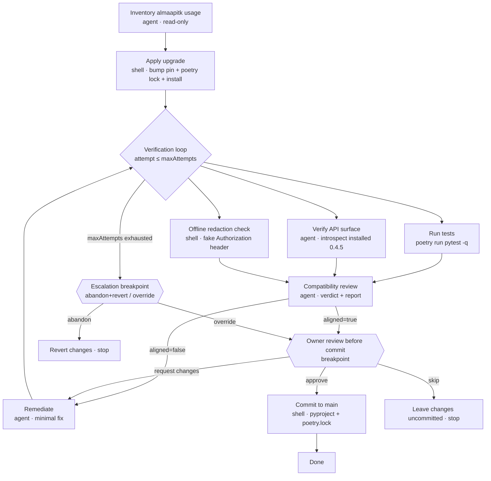

# almaapitk-upgrade-verify — flow

```mermaid
flowchart TD
    A[Inventory almaapitk usage<br/>agent · read-only] --> B[Apply upgrade<br/>shell · bump pin + poetry lock + install]
    B --> C{Verification loop<br/>attempt &le; maxAttempts}
    C --> D1[Run tests<br/>poetry run pytest -q]
    C --> D2[Verify API surface<br/>agent · introspect installed 0.4.5]
    C --> D3[Offline redaction check<br/>shell · fake Authorization header]
    D1 --> E[Compatibility review<br/>agent · verdict + report]
    D2 --> E
    D3 --> E
    E -->|aligned=false| F[Remediate<br/>agent · minimal fix] --> C
    E -->|aligned=true| G{{Owner review before commit<br/>breakpoint}}
    C -->|maxAttempts exhausted| H{{Escalation breakpoint<br/>abandon+revert / override}}
    H -->|abandon| X[Revert changes · stop]
    H -->|override| G
    G -->|approve| I[Commit to main<br/>shell · pyproject + poetry.lock]
    G -->|request changes| F
    G -->|skip| J[Leave changes uncommitted · stop]
    I --> K[Done]
```
