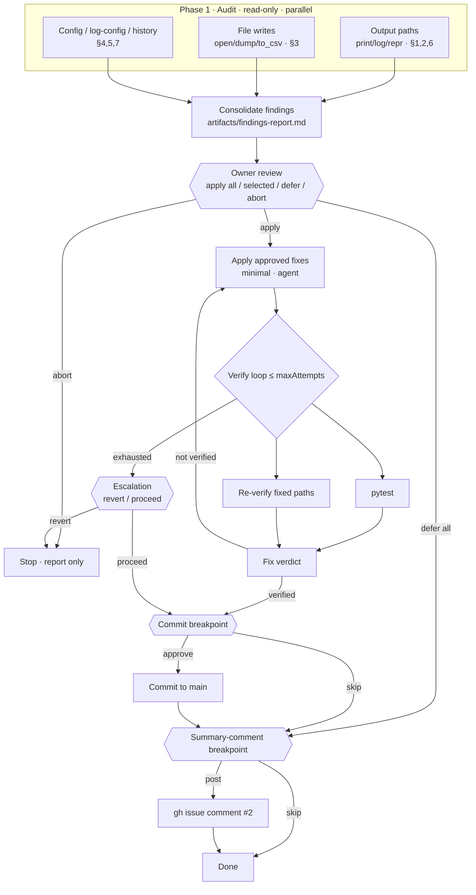

# sensitive-data-leak-audit — flow

```mermaid
flowchart TD
    subgraph AUDIT[Phase 1 · Audit · read-only · parallel]
      A1[Output paths<br/>print/log/repr · §1,2,6]
      A2[File writes<br/>open/dump/to_csv · §3]
      A3[Config / log-config / history<br/>§4,5,7]
    end
    A1 --> C[Consolidate findings<br/>artifacts/findings-report.md]
    A2 --> C
    A3 --> C
    C --> R{{Owner review<br/>apply all / selected / defer / abort}}
    R -->|abort| X[Stop · report only]
    R -->|defer all| S
    R -->|apply| F[Apply approved fixes<br/>minimal · agent]
    F --> V{Verify loop &le; maxAttempts}
    V --> T[pytest]
    V --> RV[Re-verify fixed paths]
    T --> J[Fix verdict]
    RV --> J
    J -->|not verified| F
    J -->|verified| G{{Commit breakpoint}}
    V -->|exhausted| E{{Escalation<br/>revert / proceed}}
    E -->|revert| X
    E -->|proceed| G
    G -->|approve| CM[Commit to main]
    G -->|skip| S
    CM --> S{{Summary-comment breakpoint}}
    S -->|post| P[gh issue comment #2]
    S -->|skip| Z[Done]
    P --> Z
```
